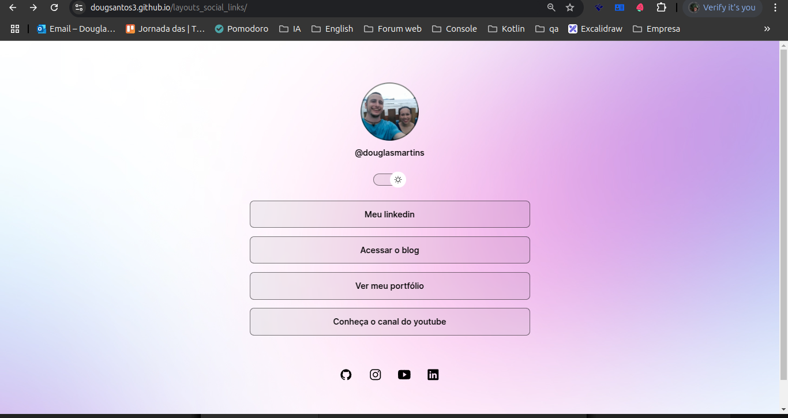
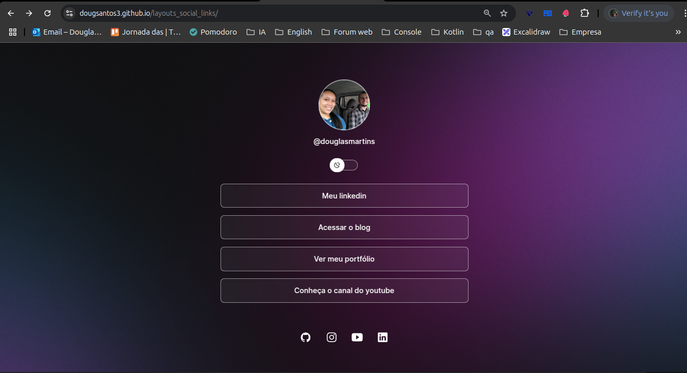

<h1 align="center">Layout with dark mode and light mode</h1>

<br />

## Getting Started

You need to download the packages:

```bash
# Node
v20.18.0 lts
```

```bash
# npm version: 11.0.0
# Download dependencies
npm install
```

### Link para acesso web

https://dougsantos3.github.io/layouts_social_links/

# Light mode

<p align="center">
  
</p>

# Dark mode

<p align="center">
  
</p>
